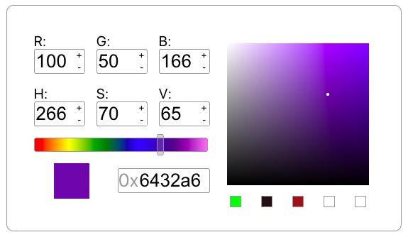

# Color Picker TS

This is a color selector control made with React and Typescript.

Supports selecting a color via one of the following methods:
- R, G and B values
- H, S, and V values
- Hexadecimal value
- Hue adjustment slider
- Click anywhere on the gradient square

Supports saving and redisplaying colors via the small boxes on the right:
- To save the current color to a box, right click the box
- To set the current color to the color in one of the boxes, left click the box
## Build/Run Details

This app was created with Create React App: [Create React App documentation](https://facebook.github.io/create-react-app/docs/getting-started).

I will follow up with more specifics on how to build and run.
